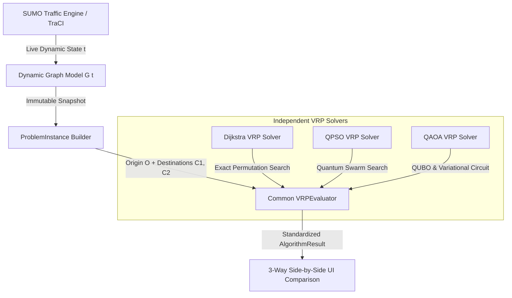

# Quantum-Inspired Intelligent Traffic Route Optimization System (VRP Architecture)

> **Real-World Pune Road Network • Dynamic SUMO Traffic Simulation • Quantum-Inspired Vehicle Routing**

An end-to-end, zero-hardcoding transportation and fleet-routing optimization system built on the real **Pune OpenStreetMap (OSM)** road network and dynamic **SUMO (Simulation of Urban MObility)** traffic engine. The system models dynamic vehicle routing problems (VRP) where a single depot/origin must serve multiple customer destinations under live traffic congestion, incidents, and road capacity constraints.

---

## Architecture Overview

The system captures real-time simulation state snapshots $G(t) = (V, E, W(t))$ from SUMO via TraCI and evaluates optimal customer visit order permutations using three algorithm paradigms operating on an identical problem instance:



---

## Core Mathematical Formulations

### 1. Dynamic Graph Model $G(t)$

The road network is represented as a directed graph $G(t) = (V, E, W(t))$ where:
- $V$: Intersections and junction nodes extracted from `osm.net.xml.gz`.
- $E$: Road segments and edges with physical attributes (length $L_e$, speed limit $v_e$, lanes $N_e$).
- $W(t)$: Dynamic edge weight vector calculated at simulation time step $t$:

$$w_e(t) = \alpha \cdot T_e(t) + \beta \cdot D_e + \gamma \cdot C_e(t) \times \text{incident\_penalty}$$

Where:
- $T_e(t) = \frac{L_e}{\max(v_{\text{mean}, e}(t), 0.1)}$ is the live dynamic travel time (seconds).
- $D_e = L_e$ is the physical road segment distance (meters).
- $C_e(t) = \frac{\text{vehicles}_e(t)}{\text{capacity}_e}$ is the edge congestion ratio.
- $\alpha, \beta, \gamma$ are multi-objective weighting parameters ($\alpha=1.0, \beta=0.0, \gamma=0.0$ default for time minimization).

---

### 2. Multi-Destination Vehicle Routing Problem (VRP)

Given:
- **Origin Depot ($O$)**: Source location selected by the user from the SUMO network.
- **Customer Destinations ($C_1, C_2, \dots, C_N$)**: $N$ target locations selected by the user.

The goal is to determine the optimal customer visit sequence $\pi = (C_{\pi(1)}, C_{\pi(2)}, \dots, C_{\pi(N)})$ minimizing total dynamic travel cost across all path legs:

$$\min_{\pi} \left[ \text{Cost}(O \rightarrow C_{\pi(1)}) + \sum_{k=1}^{N-1} \text{Cost}(C_{\pi(k)} \rightarrow C_{\pi(k+1)}) \right]$$

---

## Independent Algorithmic Solvers

### 1. Dijkstra VRP Solver (Exact Baseline)
- **Methodology**: Brute-force enumeration of all $N!$ candidate customer visit sequence permutations.
- **Path Reconstruction**: Calculates exact Dijkstra shortest paths on dynamic graph $G(t)$ for each leg.
- **Guarantee**: Produces the absolute theoretical ground-truth optimum for baseline benchmark comparison.

### 2. QPSO VRP Solver (Herrera et al., 2015)
- **Methodology**: Quantum-Behaved Particle Swarm Optimization formulated for discrete VRP.
- **Continuous Swarm State**: Particle positions $x_{i,d} \in [-2.0, 2.0]^D$ where dimension $D = N$ (number of customers).
- **Quantum Potential Field Update**:
  $$x_{i,d}(t+1) = p_{i,d} \pm \alpha(t) \cdot |mbest_d - x_{i,d}(t)| \cdot \ln\left(\frac{1}{u}\right)$$
  where $u \sim \text{Uniform}(0, 1)$ and $\pm$ is chosen with $0.5$ probability.
- **Learning Inclination Point (LIP)**:
  $$p_{i,d} = \frac{\varphi_1 \cdot pbest_{i,d} + \varphi_2 \cdot gbest_d}{\varphi_1 + \varphi_2}, \quad \varphi_1, \varphi_2 \sim \text{Uniform}(0, 1)$$
- **Mean Best Position ($mbest$)**:
  $$mbest_d = \frac{1}{M} \sum_{i=1}^{M} pbest_{i,d}$$
- **Contraction-Expansion Decay**:
  $$\alpha(t) = \alpha_{\text{start}} - \frac{t}{T_{\text{max}} - 1} (\alpha_{\text{start}} - \alpha_{\text{end}})$$
- **Rank Discretization Mapping (Sec 3.3)**: Ascending sort rank of continuous particle vector $x_{i}$ maps directly to discrete customer sequence $\pi$.

### 3. QAOA VRP Solver (Azfar et al., 2025)
- **Methodology**: Quantum Approximate Optimization Algorithm mapped to position decision binary variables.
- **Decision Variables**: $x_{i,p} \in \{0, 1\}$ representing customer $i$ visited at position $p$ ($N^2$ total qubits).
- **QUBO Formulation**:
  $$H_{\text{QUBO}} = \sum_{i,j,p} c_{i,j} x_{i,p} x_{j,p+1} + P \sum_{i} \left(1 - \sum_{p} x_{i,p}\right)^2 + P \sum_{p} \left(1 - \sum_{i} x_{i,p}\right)^2$$
- **Penalty Multiplier $P$**: Scaled dynamically as $P = 2 \sum_{i,j} |c_{i,j}|$.
- **Ising Transformation**: Maps binary variables $x_i \to \frac{I + Z_i}{2}$ to synthesize cost Hamiltonian $H_C = \sum h_i Z_i + \sum_{i < j} J_{ij} Z_i Z_j$.
- **Variational Circuit Synthesis**: Synthesizes $p$-layer QAOA ansatz $|\psi(\gamma, \beta)\rangle = \prod_{l=1}^p e^{-i \beta_l H_M} e^{-i \gamma_l H_C} |+\rangle^{\otimes n}$.
- **Classical Optimizer**: Optimizes variational angles $(\gamma, \beta)$ using COBYLA and samples top bitstrings to decode feasible visit sequences.

---

## Zero-Hardcoding Guarantees

1. **No Static Coordinate/Node Constants**: All origin and customer node selections are resolved dynamically against the live SUMO network graph (`osm.net.xml.gz`).
2. **Dynamic Edge Cost Calculation**: Travel times, distances, congestion ratios, bottlenecks, and incident penalties are computed at runtime on graph snapshot $G(t)$.
3. **Causal Evidence & Fair Evaluation**: All 3 solvers pass candidate visit sequences to a shared `VRPEvaluator` instance, generating standardized `AlgorithmResult` objects containing exact leg-by-leg metrics, segment calculations, bottlenecks, and mathematical proofs.

---

## REST API Reference

| Endpoint | Method | Description |
| :--- | :--- | :--- |
| `/api/vrp/dijkstra` | `POST` | Solve VRP using Exact Dijkstra Baseline Permutations |
| `/api/vrp/qpso` | `POST` | Solve VRP using QPSO Swarm Optimization |
| `/api/vrp/qaoa` | `POST` | Solve VRP using QAOA Quantum Variational Optimization |
| `/api/vrp/compare` | `POST` | Execute all 3 solvers concurrently on graph $G(t)$ for side-by-side comparison |
| `/api/network/resolve-node` | `GET` | Resolve nearest valid network node from map click (lat/lon coordinates) |
| `/ws` | `WebSocket` | Real-time SUMO simulation state stream & step control |

### Example Request (`POST /api/vrp/compare`)
```json
{
  "origin_node": "node_12345",
  "destination_nodes": ["node_67890", "node_54321"],
  "vehicle_capacity": 100.0,
  "alpha": 1.0,
  "beta": 0.0,
  "gamma": 0.0,
  "num_particles": 40,
  "max_iter": 50,
  "reps": 1,
  "shots": 1024
}
```

---

## Quickstart & How to Run

### Prerequisites
- **Operating System**: Windows / Linux / macOS
- **Python**: Version 3.10 or higher
- **SUMO Traffic Simulator**: Installed and added to system `PATH` (or `SUMO_HOME` environment variable configured).

### 1. Launch Project Server
To start the FastAPI backend server and serve the interactive web UI:

```cmd
run.bat
```
*Alternatively, run manually via Python:*
```bash
python -m uvicorn backend.api.server:app --reload --port 8000
```
Open your browser and navigate to: **`http://localhost:8000`**

### 2. Execute Automated Unit Tests
To verify all VRP solvers, dynamic graph transformations, evaluator engines, and API components:

```bash
python -m unittest discover -s tests -p "test_*.py"
```
*All 15 test cases should report `OK`.*

---

## Interactive UI Usage

1. **Start Simulation**: Click **Start SUMO** in the top control bar.
2. **Select VRP Nodes**:
   - Click **Set Origin (O)** and click any road junction on the Pune map.
   - Click **Set Customer 1 (C1)** and select the first destination.
   - Click **Set Customer 2 (C2)** and select the second destination.
3. **Run Optimization**: Click **Run VRP Comparison**.
4. **Inspect Results**: View multi-colored route polylines on the map and open the **3-Way Side-by-Side Comparison Modal** to compare visit sequences, travel times, distances, bottlenecks, and mathematical proofs.
