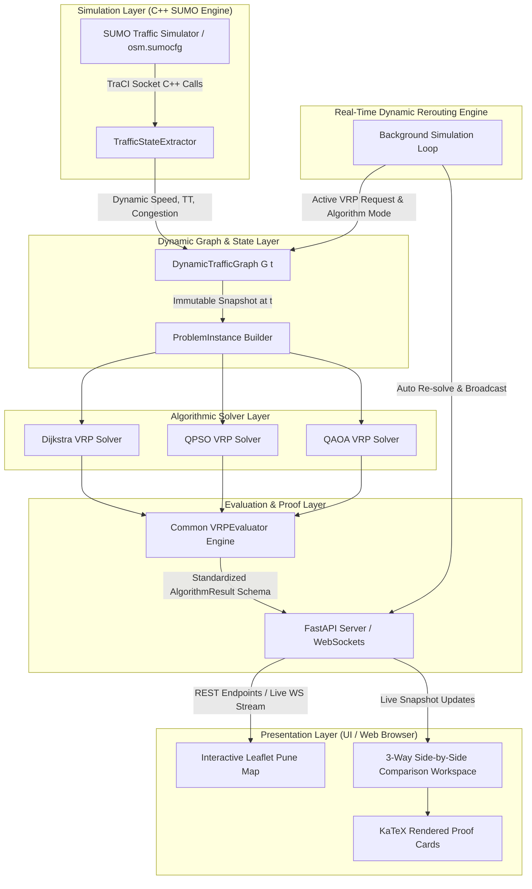

# Quantum-Inspired Intelligent Traffic Route Optimization System (VRP Architecture)

> **Real-World Pune Road Network • Dynamic SUMO Traffic Simulation • Quantum-Inspired Vehicle Routing • Real-Time Dynamic Rerouting**

An end-to-end, zero-hardcoding transportation and fleet-routing optimization system built on the real **Pune OpenStreetMap (OSM)** road network and dynamic **SUMO (Simulation of Urban MObility)** traffic engine via TraCI. The system models dynamic Vehicle Routing Problems (VRP) where a single depot/origin serves multiple customer destinations under live traffic congestion, incidents, and road capacity constraints.

---

## Complete Software System Architecture

The software architecture consists of a reactive, decoupled multi-layer pipeline connecting SUMO traffic simulation, graph theory models, quantum-inspired optimization algorithms, REST APIs, WebSockets, and an interactive Leaflet frontend:



---

## Core Mathematical Formulations

### 1. Dynamic Graph Model $G(t)$

The road network is represented as a directed graph $G(t) = (V, E, W(t))$ where:
- $V$: Intersections and junction nodes extracted dynamically from `osm.net.xml.gz`.
- $E$: Directed road segments and edges with physical attributes (length $L_e$, speed limit $v_e$, lane count $N_e$).
- $W(t)$: Dynamic edge weight vector calculated at simulation time step $t$:

$$w_e(t) = \left( \alpha \cdot T_e(t) + \beta \cdot D_e + \gamma \cdot (C_e(t) \times 100) \right) \times \text{incident\_penalty}_e$$

Where:
- $T_e(t) = \frac{L_e}{\max(v_{\text{mean}, e}(t), 0.1)}$ is the live dynamic travel time (seconds).
- $D_e = L_e$ is the physical road segment distance (meters).
- $C_e(t) = \max\left(0, 1 - \frac{v_{\text{mean}, e}(t)}{v_{\text{limit}, e}}\right) \in [0, 1]$ is the edge congestion ratio.
- $\alpha, \beta, \gamma$ are multi-objective weights ($\alpha=1.0, \beta=0.0, \gamma=0.0$ default for time minimization).

---

### 2. Multi-Destination Vehicle Routing Problem (VRP)

Given:
- **Origin Depot ($O$)**: Source depot selected by the user from the SUMO network graph.
- **Customer Destinations ($C_1, C_2, \dots, C_N$)**: $N$ target destinations selected by the user ($N \in [1, 5]$).

The goal is to find the optimal customer visit sequence $\pi = (C_{\pi(1)}, C_{\pi(2)}, \dots, C_{\pi(N)})$ minimizing total dynamic travel cost across all path legs:

$$\min_{\pi} \left[ \text{Cost}_{G(t)}(O \rightarrow C_{\pi(1)}) + \sum_{k=1}^{N-1} \text{Cost}_{G(t)}(C_{\pi(k)} \rightarrow C_{\pi(k+1)}) \right]$$

---

## Three Independent Algorithmic Solvers

### 1. Dijkstra VRP Solver (Exact Baseline)
- **Methodology**: Evaluates all $N!$ customer visit sequence permutations on $G(t)$.
- **Leg Evaluation**: Runs NetworkX Dijkstra shortest path search for every sequence leg on $G(t)$.
- **Guarantee**: Computes the absolute theoretical ground-truth optimum for baseline benchmark comparison.

### 2. QPSO VRP Solver (Herrera et al., 2015)
- **Methodology**: Discrete Quantum-Behaved Particle Swarm Optimization.
- **Continuous Swarm State**: Particle positions $x_{i,d} \in [-2.0, 2.0]^D$ where dimension $D = N$ (number of customers).
- **Quantum Potential Field Position Update**:
  $$x_{i,d}(t+1) = p_{i,d} \pm \alpha(t) \cdot |mbest_d - x_{i,d}(t)| \cdot \ln\left(\frac{1}{u}\right)$$
  where $u \sim \text{Uniform}(0, 1)$ and $\pm$ is chosen with $0.5$ probability.
- **Learning Inclination Point (LIP)**:
  $$p_{i,d} = \frac{\varphi_1 \cdot pbest_{i,d} + \varphi_2 \cdot gbest_d}{\varphi_1 + \varphi_2}, \quad \varphi_1, \varphi_2 \sim \text{Uniform}(0, 1)$$
- **Mean Best Position Vector ($mbest$)**:
  $$mbest_d = \frac{1}{M} \sum_{i=1}^{M} pbest_{i,d}$$
- **Linear Contraction-Expansion Decay**:
  $$\alpha(t) = \alpha_{\text{start}} - \frac{t}{T_{\text{max}} - 1} (\alpha_{\text{start}} - \alpha_{\text{end}}), \quad (1.0 \to 0.5)$$
- **Rank Discretization Mapping (Sec 3.3)**: Ascending sort rank of continuous particle vector $x_{i}$ defines discrete customer visit sequence $\pi$.

### 3. QAOA VRP Solver (Azfar et al., 2025)
- **Methodology**: Quantum Approximate Optimization Algorithm mapped to position decision binary variables.
- **Decision Variables**: $x_{i,p} \in \{0, 1\}$ representing customer $i$ visited at position $p$ ($N^2$ total qubits).
- **QUBO Matrix & Ising Hamiltonian**:
  $$H_{\text{QUBO}} = \sum_{i,j,p} c_{i,j} x_{i,p} x_{j,p+1} + P \sum_{i} \left(1 - \sum_{p} x_{i,p}\right)^2 + P \sum_{p} \left(1 - \sum_{i} x_{i,p}\right)^2$$
- **Dynamic Penalty Scaling**: $P = 2 \sum_{i,j} |c_{i,j}|$ where $c_{i,j}$ are leg costs extracted from $G(t)$.
- **Variational Circuit Synthesis**: Synthesizes $p$-layer Qiskit ansatz $|\psi(\boldsymbol{\gamma}, \boldsymbol{\beta})\rangle = \prod_{l=1}^p e^{-i \beta_l H_M} e^{-i \gamma_l H_C} |+\rangle^{\otimes n}$.
- **Classical Optimization**: Optimizes $(\boldsymbol{\gamma}, \boldsymbol{\beta})$ using COBYLA, samples top bitstrings, decodes customer sequence, and evaluates physical paths on $G(t)$.

---

## Key System Features

### 1. Real-Time Dynamic Rerouting Engine
- The backend simulation loop tracks the user's active algorithm selection (`"dijkstra"`, `"qpso"`, `"qaoa"`, or `"compare"`).
- As SUMO steps forward (~every 3s) or when traffic accidents are injected/cleared, the backend **automatically re-solves the VRP using the last selected algorithm** on live graph $G(t)$ and streams updated route polylines over WebSockets.
- Leaflet map polylines and metric cards update live without requiring manual button clicks.

### 2. Snapshot Synchronization & Timestamps
- Single solver runs display `Snapshot Timestamp: t = X.X s` on the results card.
- Explains why real-time single clicks at $t_1, t_2, t_3$ differ slightly from a synchronized 3-Way Snapshot captured at $t_0$.

### 3. KaTeX Rendered Mathematical Proof Cards
- All solver proof tabs feature rendered KaTeX equations, parameter tables, and step-by-step mathematical derivations.

---

## REST & WebSocket API Reference

| Endpoint | Method | Description |
| :--- | :--- | :--- |
| `/api/vrp/dijkstra` | `POST` | Solve VRP using Exact Dijkstra Baseline Permutations |
| `/api/vrp/qpso` | `POST` | Solve VRP using QPSO Swarm Optimization |
| `/api/vrp/qaoa` | `POST` | Solve VRP using QAOA Quantum Variational Optimization |
| `/api/vrp/compare` | `POST` | Execute all 3 solvers concurrently on snapshot $G(t_0)$ for 3-way comparison |
| `/api/network/resolve-node` | `GET` | Resolve nearest valid network node from map click coordinates |
| `/ws` | `WebSocket` | Real-time SUMO simulation state stream & step control |

### Example Request (`POST /api/vrp/compare`)
```json
{
  "origin_node": "node_12345",
  "destination_nodes": ["node_67890", "node_54321", "node_98765"],
  "vehicle_capacity": 100.0,
  "alpha": 1.0,
  "beta": 0.0,
  "gamma": 0.0,
  "num_particles": 40,
  "max_iter": 50,
  "reps": 1,
  "shots": 1024
}
```

---

## Quickstart & Verification Guide

### Prerequisites
- **Python**: Version 3.10+
- **SUMO Traffic Simulator**: Installed and available on system `PATH` (or `SUMO_HOME` set).

### 1. Launch Project Server
```cmd
run.bat
```
*Or via command line:*
```bash
python -m uvicorn backend.api.server:app --reload --port 8000
```
Navigate to: **`http://localhost:8000`**

### 2. Execute Automated Unit Tests
To verify all VRP solvers, dynamic graph transformations, snapshot timestamps, and real-time rerouting:

```bash
python -m unittest discover -s tests -p "test_*.py"
```
*All 23 test cases should report `OK`.*
